# ECON-2080-SPRING2026

**PhD Macroeconomics — Spring 2026**

This repository contains the code and results for the problem sets assigned in **ECON 2080**, a PhD-level Macroeconomics course. The course covers three main thematic areas:

- **Labor Markets** — search-and-matching models, wage determination, and unemployment dynamics
- **Distribution Economics** — heterogeneous-agent frameworks, income and wealth inequality, and distributional dynamics
- **Growth Models** — neoclassical and endogenous growth theory, capital accumulation, and long-run dynamics

---

## Repository Structure

```
ECON-2080-SPRING2026/
├── ProblemSet1/                  # Labor Market Models
│   ├── code/
│   │   └── labor_market.py       # Mortensen-Pissarides model
│   └── results/                  # Output figures
├── ProblemSet2/                  # Distribution Economics
│   ├── code/
│   │   └── distribution_economics.py   # Aiyagari/Huggett model
│   └── results/
├── ProblemSet3/                  # Growth Models
│   ├── code/
│   │   └── growth_models.py      # Solow, Ramsey-CK, AK model
│   └── results/
└── README.md
```

Each problem set folder contains:
- `code/` — all source scripts used to produce results
- `results/` — figures, tables, and any numerical output generated by the code

---

## Requirements

### Python
- Python 3.9+
- `numpy`, `scipy`, `matplotlib`, `pandas`

Install Python dependencies with:
```bash
pip install numpy scipy matplotlib pandas
```

---

## Usage

1. Clone the repository:
   ```bash
   git clone https://github.com/jorgeluis8ar/ECON-2080-SPRING2026.git
   cd ECON-2080-SPRING2026
   ```

2. Navigate to the problem set of interest:
   ```bash
   cd ProblemSet1/code
   ```

3. Run the script:
   ```bash
   python labor_market.py
   ```

4. Results are saved automatically to `../results/`.

---

## Problem Set 1 — Labor Markets

### Model: Mortensen-Pissarides (1994)

This problem set implements the canonical **search-and-matching model** of the labor
market. A **Cobb-Douglas matching function** M(u, v) = m · u^α · v^(1−α) governs how
unemployed workers (u) and vacant jobs (v) meet. Key equilibrium objects are:

- **Job-finding rate** p(θ) = m · θ^(1−α): increasing in market tightness θ = v/u
- **Vacancy-filling rate** q(θ) = m · θ^(−α): decreasing in θ
- **Steady-state unemployment** u\* = δ / (δ + p(θ)): equates inflows (job destruction)
  with outflows (job finding)
- **Nash-bargained wage**: w(θ) = β(y + c·θ) + (1−β)b

Equilibrium tightness θ\* is pinned down by the **free-entry (Job Creation) condition**
and the **Nash-bargaining wage curve** jointly.

---

### Figure 1.1 — Beveridge Curve

The **Beveridge Curve** plots the steady-state combinations of unemployment (u) and
vacancies (v) as market tightness θ varies. It is downward-sloping because a tighter
labor market (more vacancies relative to unemployment) raises the job-finding rate,
reducing equilibrium unemployment. The red dot marks the baseline equilibrium at θ = 1.

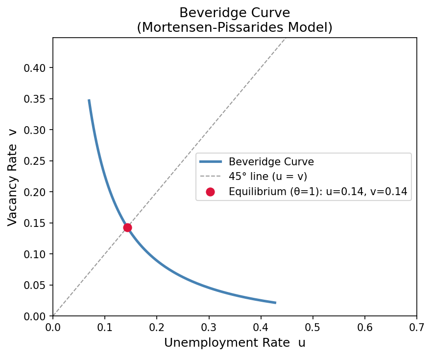

> **Reading the graph:** Moving along the curve corresponds to different aggregate labor
> market conditions. Outward shifts of the entire curve (not shown here) reflect structural
> changes such as improved matching efficiency or changes in the job-destruction rate.

---

### Figure 1.2 — Job-Finding and Vacancy-Filling Rates

These two curves show how the **worker's job-finding probability** p(θ) and the
**firm's vacancy-filling probability** q(θ) respond to market tightness. Workers benefit
from a tighter market (higher p), while firms face greater recruiting difficulty (lower q).
This trade-off is at the heart of the bilateral nature of search frictions.

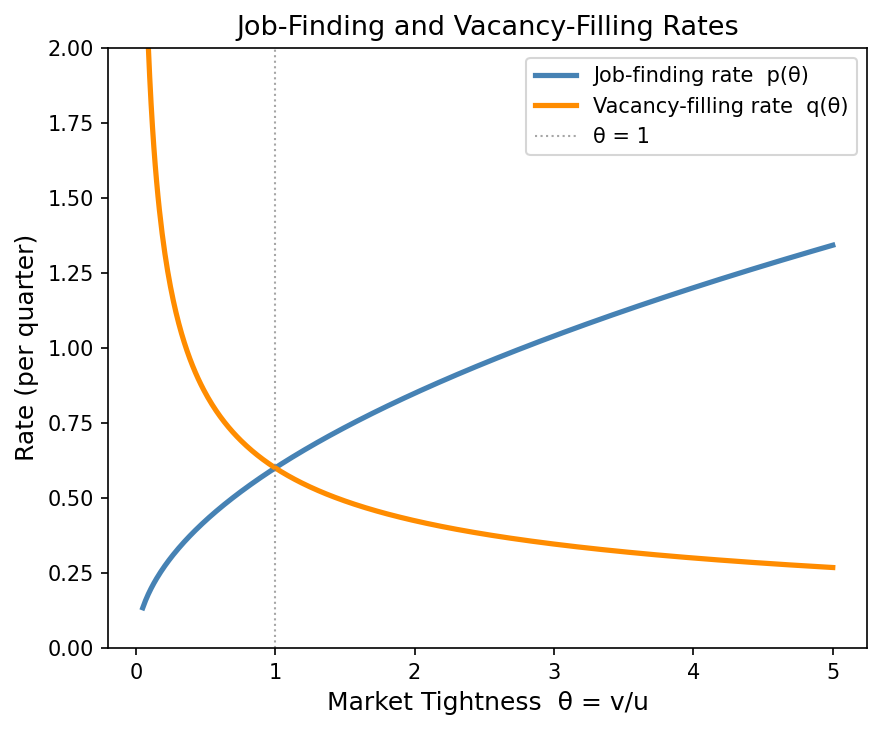

> **Key insight:** At θ = 1, both probabilities equal the matching efficiency m (here 0.6).
> As θ → ∞, workers find jobs instantly (p → ∞) but firms struggle to fill vacancies (q → 0).

---

### Figure 1.3 — Equilibrium JC and Wage Curves

The **Job-Creation (JC) curve** gives the maximum wage firms are willing to pay consistent
with the free-entry condition (zero expected profits from vacancy posting). It is
decreasing in θ because tighter markets make hiring more expensive. The **Wage Curve (WC)**
gives the Nash-bargained wage, which is increasing in θ because workers have more bargaining
power when alternatives are plentiful. The intersection determines **equilibrium tightness θ\*** and **equilibrium wage w\***.

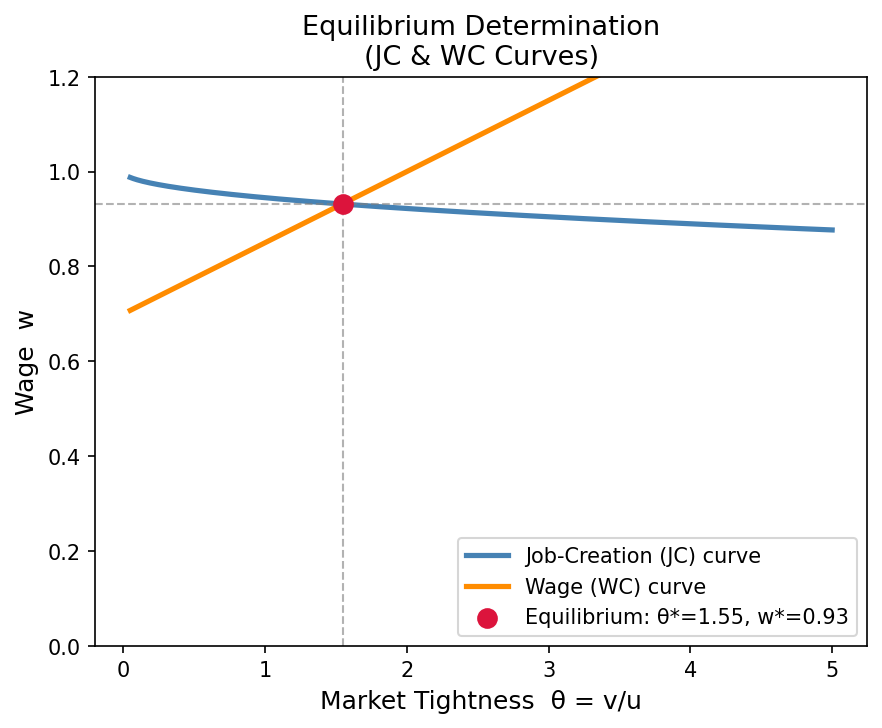

> **Comparative statics:** An increase in productivity y shifts JC up → higher θ\* and w\*.
> An increase in bargaining power β rotates WC up → lower θ\* but higher w\*
> (the "hold-up" problem: strong workers reduce job creation).

---

### Figure 1.4 — Policy Experiment: Unemployment Insurance

This experiment varies the **UI replacement rate** b from 5% to 90% of productivity and
computes how equilibrium tightness θ\*(b) and steady-state unemployment u\*(b) respond.
Higher b raises the worker's outside option, pushing up the Nash wage and reducing firms'
incentive to post vacancies. The result is lower market tightness and higher unemployment.

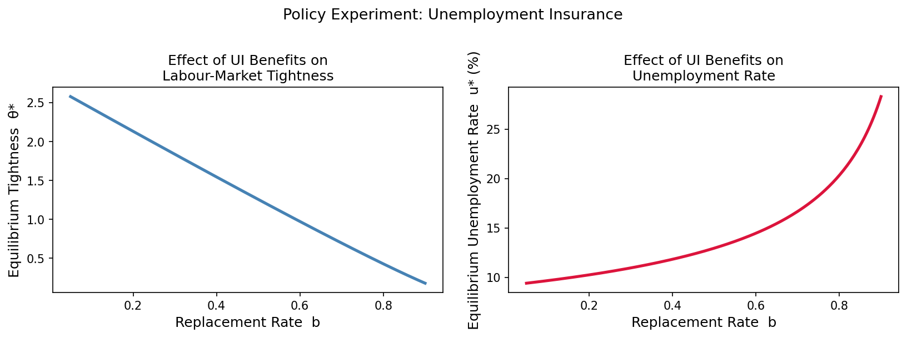

> **Policy implication:** The model predicts that generous unemployment insurance
> increases the equilibrium unemployment rate — not because it reduces search effort
> (here effort is exogenous), but because it reduces job creation through higher wages.

---

## Problem Set 2 — Distribution Economics

### Model: Incomplete-Markets / Huggett-Aiyagari Economy

This problem set implements a **heterogeneous-agent, incomplete-markets** model in
the spirit of Huggett (1993) and Aiyagari (1994). A continuum of households faces
idiosyncratic labor-income risk (a two-state Markov chain: z ∈ {z_L, z_H}) and can
only self-insure by saving in a single risk-free bond. A **borrowing constraint**
(a ≥ ā) prevents households from borrowing more than ā.

The household's dynamic programming problem is:

```
V(a, z) = max_{a'} [ u(c) + β · Σ_z' P(z,z') V(a', z') ]
    s.t.  c = (1 + r) a + w z - a'
          a' ≥ ā,   c ≥ 0
```

Solved by **Value Function Iteration (VFI)**: iterate the Bellman operator to convergence
(‖V_{n+1} − V_n‖_∞ < 10⁻⁶). The stationary distribution is obtained by simulating
a panel of 5,000 households for 3,000 periods and collecting the ergodic cross-section.

---

### Figure 2.1 — Policy Functions

The left panel shows the **optimal savings policy** a'(a, z): households save more when
current assets or income are higher. Near the borrowing constraint (left edge) the policy
function is kinked — constrained households cannot smooth consumption further by borrowing.
The 45-degree line marks the boundary between saving and dis-saving.

The right panel shows the corresponding **consumption policy** c(a, z): consumption is
increasing and concave in assets, exhibiting the typical buffer-stock behavior.

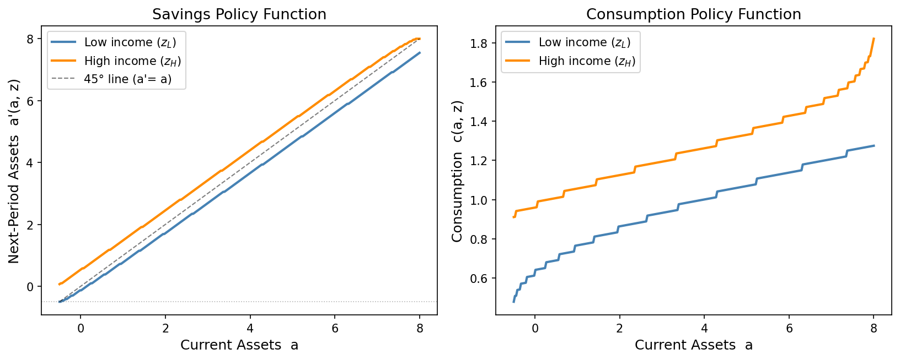

> **Buffer-stock saving:** For low-income households near the constraint, marginal
> propensity to consume (MPC) is close to 1. For wealthy households in the high-income
> state, MPC is much lower — a central feature of these models consistent with
> empirical estimates of heterogeneous MPCs.

---

### Figure 2.2 — Stationary Asset Distribution and Lorenz Curve

The **left panel** shows the ergodic (stationary) cross-sectional distribution of
household wealth. The distribution has a long right tail — a few rich households hold
a disproportionate share of total wealth — consistent with the empirical wealth
distribution in the U.S. and other economies.

The **Lorenz Curve** (right panel) plots the cumulative share of wealth held by the
bottom x% of the population. The farther the curve bows below the 45-degree line
(perfect equality), the more unequal the distribution. The **Gini coefficient**,
displayed in the legend, summarises this inequality in a single number (0 = perfect
equality, 1 = maximum inequality).

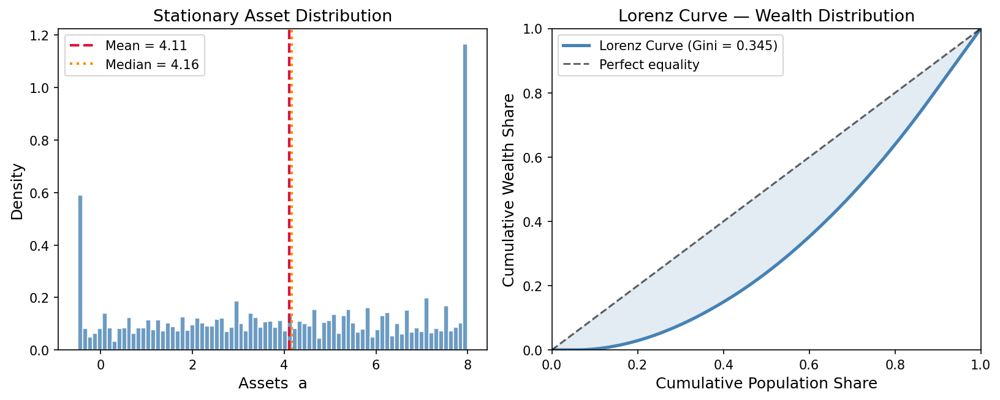

> **Calibration note:** The model-generated Gini (≈ 0.3–0.5) is in the right ballpark
> for U.S. earnings inequality, but significantly below the U.S. wealth Gini (≈ 0.85).
> Richer models add entrepreneurial risk, heterogeneous returns, or bequest motives to
> match the extreme upper tail.

---

### Figure 2.3 — Gini Coefficient vs. Borrowing Constraint

This figure shows how the **Gini coefficient** (a summary measure of wealth inequality)
changes as we vary the borrowing constraint ā from very tight (ā = 0.5, no borrowing)
to very loose (ā = −2, allows significant debt).

Tightening the constraint forces low-wealth households to hold more precautionary
savings as a buffer, compressing the lower tail of the wealth distribution and reducing
inequality. Relaxing the constraint allows larger variation in wealth outcomes, raising the Gini.

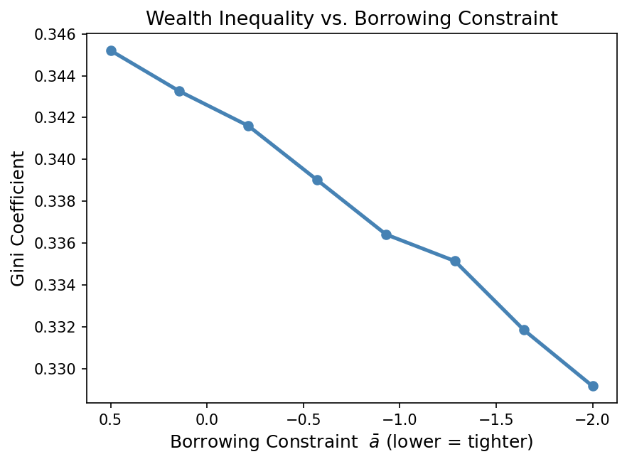

> **Policy takeaway:** Expanding access to credit (relaxing borrowing constraints)
> can increase measured wealth inequality, even if it raises welfare by allowing
> better consumption smoothing. This illustrates the distinction between inequality
> and welfare — a recurring theme in the distribution-economics literature.

---

## Problem Set 3 — Growth Models

### Models Covered

1. **Solow-Swan (1956)** — Exogenous growth driven by capital accumulation; converges
   to a steady state determined by the savings rate, depreciation, and population/TFP growth.
2. **Ramsey-Cass-Koopmans (1965)** — Optimal growth with microfounded saving: households
   choose a consumption path to maximise discounted lifetime utility; the steady state
   satisfies the **modified golden rule**.
3. **AK Endogenous Growth** — Linear production in capital eliminates diminishing
   returns; the economy grows forever at a rate determined by preferences and technology.

All models are expressed in **intensive (per-effective-worker) form**:
k = K/(AL), c = C/(AL), where A is the technology index growing at rate g.

---

### Figure 3.1 — Solow-Swan Diagram

The Solow diagram plots the **savings curve** sf(k) and the **required-investment line**
(δ + n + g)k against capital per effective worker k. Their intersection is the
**steady-state capital** k\*. The golden rule capital k_gr (marked in gold) maximises
steady-state consumption; under Cobb-Douglas production, k_gr corresponds to saving rate s = α.

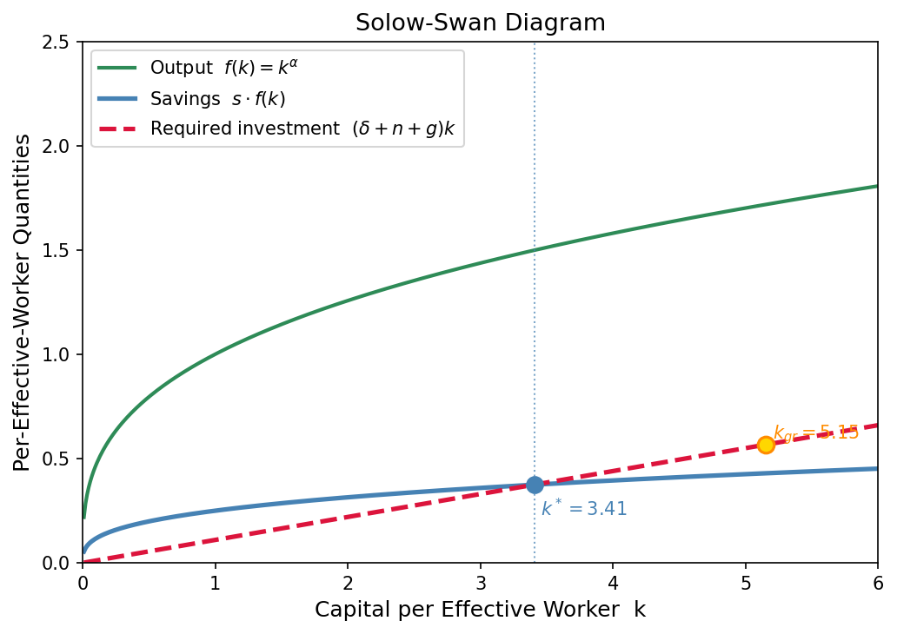

> **Key property — conditional convergence:** Economies with identical parameters but
> different initial conditions converge to the same k\*. The speed of convergence is
> approximately (1 − α)(δ + n + g) per year — empirically around 2% per year for
> cross-country data (Mankiw, Romer & Weil 1992).

---

### Figure 3.2 — Solow Transitional Dynamics

The left panel shows **capital paths k(t)** converging to the steady state k\* from
various starting points (above and below k\*). Convergence is monotone and faster when
the economy starts further from k\*. The right panel shows **output paths y(t)** for
different savings rates, illustrating how a permanently higher s raises the long-run
level of output but not its long-run growth rate.

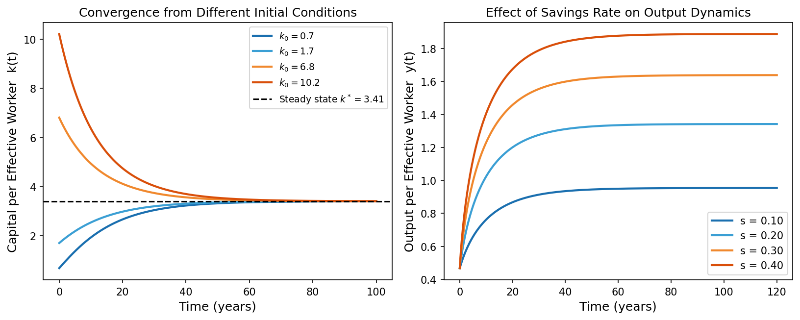

> **Level vs. growth effects:** The Solow model predicts that changes in s affect the
> *level* of the balanced growth path but not its long-run growth *rate* (which equals
> g, the rate of technological progress). This stands in contrast to endogenous growth
> models where savings/investment choices permanently affect the growth rate.

---

### Figure 3.3 — Ramsey-Cass-Koopmans Phase Diagram

The phase diagram in the **(k, c) plane** is the central tool for analysing the
Ramsey model. Two loci divide the plane into four regions:

- **k̇ = 0 locus** (blue curve): c = f(k) − (δ+n+g)k — above this locus, k is falling;
  below it, k is rising.
- **ċ = 0 locus** (red vertical line): k = k\*\* where f'(k) = δ + ρ + θg — to the left,
  c is rising; to the right, c is falling.

The **steady state (BGP)** is the intersection. The **saddle path** (unique stable
manifold) is the single trajectory satisfying the transversality condition; grey lines
show trajectories starting near the BGP in various directions.

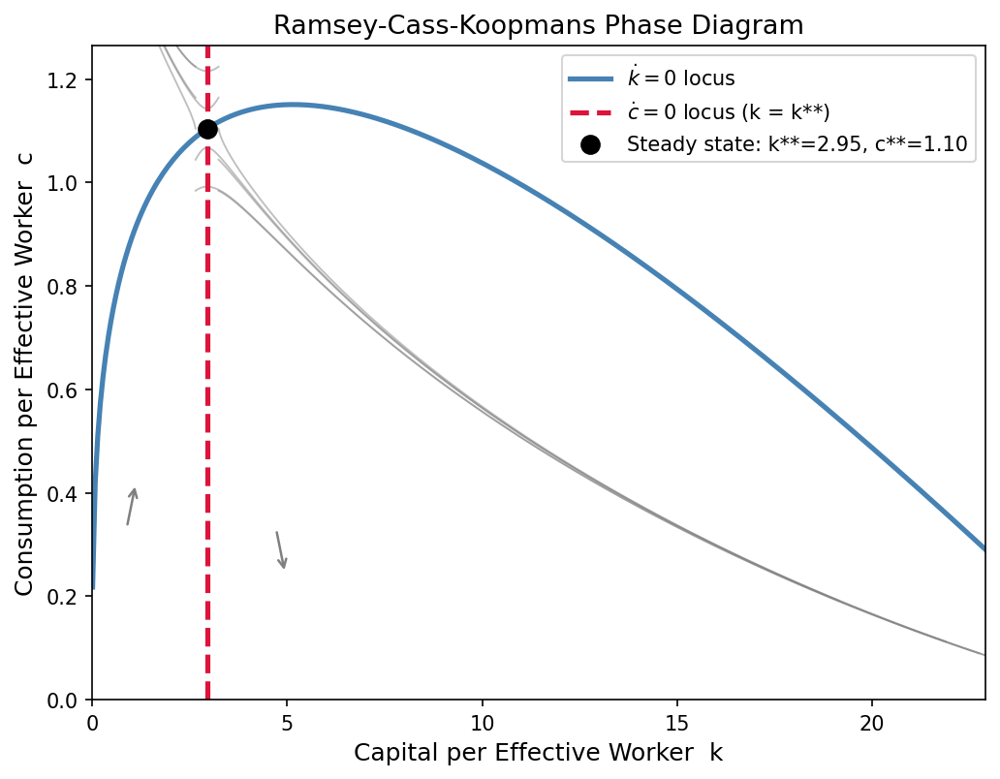

> **Modified golden rule vs. golden rule:** The Ramsey BGP capital k\*\* < k_gr (golden
> rule) because impatient households (ρ > 0) consume more early on, under-accumulating
> capital relative to the social planner who weights all generations equally.

---

### Figure 3.4 — AK Endogenous Growth vs. Solow Model

The AK model replaces the concave Cobb-Douglas production with a linear technology
Y = AK, eliminating diminishing returns to capital. The left panel compares **normalised
capital paths**: capital (and output) grow exponentially in the AK model, while the
Solow model's capital eventually stagnates at k\*. The right panel shows **output growth
rates**: the AK model sustains a constant positive growth rate g\* = (A − δ − ρ)/θ,
whereas the Solow growth rate declines to zero in the absence of exogenous TFP growth.

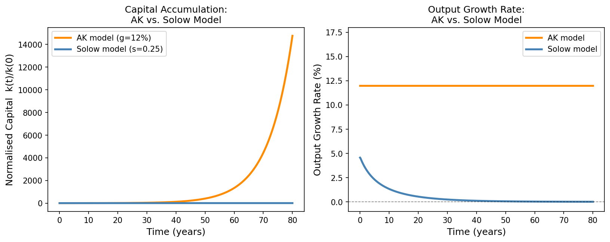

> **Endogenous vs. exogenous growth:** In the AK model, a permanently higher investment
> rate raises the *long-run growth rate* (not just the level), because there are no
> diminishing returns to capital. This scale effect is the defining feature of first-
> generation endogenous growth models and motivates policies that encourage investment
> or R&D as engines of sustained growth.

---

## Code Summary

All code is written in **Python 3** and documented with inline comments explaining
the economic model and numerical methods. Key techniques used:

| Problem Set | Main Method | File |
|-------------|-------------|------|
| PS1 — Labor Markets | Analytical steady state, comparative statics | `ProblemSet1/code/labor_market.py` |
| PS2 — Distribution | Value Function Iteration (VFI), Monte Carlo simulation | `ProblemSet2/code/distribution_economics.py` |
| PS3 — Growth | ODE integration (RK45), phase plane analysis | `ProblemSet3/code/growth_models.py` |

Numerical methods overview:
- **Value Function Iteration (VFI)** — Iterates the Bellman operator until convergence
  (sup-norm < 10⁻⁶). Pre-computes the full utility matrix for efficiency.
- **ODE integration** — Uses `scipy.integrate.solve_ivp` with an adaptive RK45 scheme
  for reliable handling of stiff transitions near steady states.
- **Monte Carlo simulation** — Simulates a large panel (5,000 households × 3,000 periods)
  to obtain the ergodic wealth distribution; interpolates policy functions off the grid.

---

## License

This repository is provided for educational purposes. See [LICENSE](LICENSE) for details.

---

## Contact

**Jorge Luis** — PhD student, Department of Economics  
Repository: [github.com/jorgeluis8ar/ECON-2080-SPRING2026](https://github.com/jorgeluis8ar/ECON-2080-SPRING2026)
